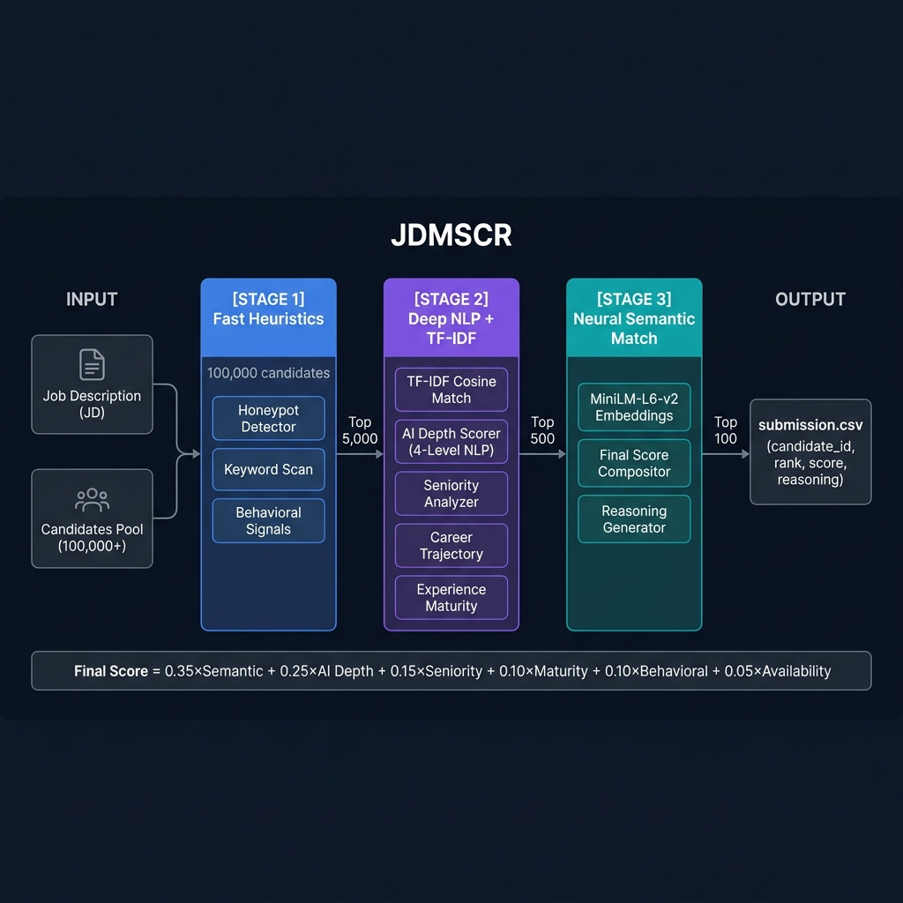

<div align="center">

# JDMSCR
### JD-Aware Multi-Signal Contextual Ranker

**An intelligent, explainable AI candidate ranking system**

---

**Team Name:** Surge  
**Team Leader:** Adharsh V S

</div>

---

## Problem Statement

Traditional candidate matching systems rely on **keyword overlap** between a job description's skill tags and a candidate's listed skills. This approach is fundamentally flawed — it surfaces candidates who list the right buzzwords, not those who have done the actual work.

The core challenge: given a pool of 100,000+ candidates and a detailed job description for a **Senior AI Engineer** role (Founding Team), rank the **Top 100 most qualified candidates** with full explainability — in under 5 minutes on a CPU, with no internet access at inference time.

---

## Solution Overview

### What is JDMSCR?

JDMSCR (JD-Aware Multi-Signal Contextual Ranker) is a **3-stage candidate ranking pipeline** that reads what candidates actually built — not what they list on their profiles.

Instead of matching `skills[]` tags, JDMSCR performs NLP on **career history descriptions**, scoring candidates on the verbs they use in proximity to AI nouns (`built`, `deployed`, `architected` near `RAG`, `ranking`, `recommendation`). It layers behavioral signals, temporal AI credibility, and neural semantic embeddings to produce a fair, explainable final rank.

### What Differentiates This Approach?

| Traditional Keyword Matching | JDMSCR |
|---|---|
| Matches `skills[]` array tags | Reads career history `description` text |
| Rewards buzzword stuffing | Penalizes buzzword stuffing with zero implementation verbs |
| Binary skill presence/absence | 4-level verb-proximity depth scoring |
| No fraud detection | Probabilistic honeypot detection (6 independent checks) |
| Single score, no explanation | Factual per-candidate reasoning attached to every rank |
| Needs GPU or internet | Runs fully offline, CPU-only, <2 GB RAM |

---

## JD Understanding & Candidate Evaluation

### Key Requirements Extracted from the JD

The role description was parsed into a structured signal hierarchy:

**Must-Have Signals:**
- Production experience with retrieval systems: RAG, vector search, semantic search, BM25, hybrid search
- Ranking and recommendation system builds: LTR, NDCG optimization, reranking
- Evidence of shipping and scaling — not just implementing
- Python, PyTorch, HuggingFace / sentence-transformers proficiency
- 5+ years in product-first AI (not consulting-heavy)

**Strong Differentiators:**
- Pre-2023 AI work (before LLM hype): weighted 1.5× in temporal credibility
- Leadership verbs (`architected`, `led`, `owned`, `spearheaded`) near AI nouns
- Product company trajectory vs. pure services background
- Evaluation rigor (offline A/B testing, NDCG, MRR)

**Disqualifying Signals:**
- Pure computer vision / speech / robotics domain
- Profiles with impossible timelines (future dates, education after work start)
- Claimed "15 years exp" with 3 years of actual job history

### How Candidate Fit Is Evaluated Beyond Keyword Matching

**AI Depth Score (4-Level NLP):**  
For each job in a candidate's career history, JDMSCR checks for co-occurrence of AI nouns and action verbs. The verb determines the depth level:

| Level | Verbs | Signal |
|---|---|---|
| L4 — Leadership | architected, led, owned, spearheaded, designed | Built and owned the system |
| L3 — Production | deployed, scaled, optimized, productionized, shipped | Took it to production |
| L2 — Implementation | built, developed, implemented, created, engineered | Wrote the actual code |
| L1 — Awareness | used, worked on, assisted, researched | Peripheral involvement |

**Behavioral Hirability Signals:**  
A candidate with perfect skills who never responds to recruiters has zero real-world value. JDMSCR incorporates: response rate, interview completion rate, notice period, open-to-work status.

---

## Ranking Methodology

### How the System Retrieves, Scores, and Ranks Candidates

JDMSCR uses a **3-stage elimination funnel** to handle 100K candidates within the compute budget:

```
100,000 Candidates
        │
   ┌────▼────────────────────────────────────────────────┐
   │  STAGE 1 — Fast Heuristics               (~10s)     │
   │  • Honeypot probability scoring                      │
   │  • Fast AI keyword hit score                         │
   │  • Behavioral availability score                     │
   └────┬────────────────────────────────────────────────┘
        │ Top 5,000
   ┌────▼────────────────────────────────────────────────┐
   │  STAGE 2 — Deep NLP + TF-IDF             (~60s)     │
   │  • TF-IDF cosine similarity vs. JD text              │
   │  • AI Depth Score (4-level verb proximity)           │
   │  • Seniority + Career Trajectory scoring             │
   │  • Experience Maturity (logistic curve)              │
   └────┬────────────────────────────────────────────────┘
        │ Top 500
   ┌────▼────────────────────────────────────────────────┐
   │  STAGE 3 — Neural Semantic Match         (~30s)     │
   │  • all-MiniLM-L6-v2 embeddings                       │
   │  • Final weighted score composition                  │
   │  • Monotone rank ordering + reasoning generation     │
   └────┬────────────────────────────────────────────────┘
        │ Top 100 → submission.csv
```

### Models, Algorithms, and Heuristics

| Component | Method | Rationale |
|---|---|---|
| Stage 1 filtering | Rule-based heuristics + heapq streaming | O(N) memory-flat pass over 100K |
| Honeypot detection | Probabilistic 6-rule compound scoring | Soft penalty, not hard exclusion |
| Stage 2 NLP | Regex verb-proximity pattern matching | Zero dependencies, interpretable |
| Stage 2 semantic | TF-IDF (scikit-learn), unigram+bigram | Fast baseline for top-500 selection |
| Stage 3 semantic | `all-MiniLM-L6-v2` cosine similarity | 384-dim, ~80MB, 30s for 500 on CPU |
| Fraud detection | Technology timeline rules + gap analysis | Catches impossible profile claims |

### How Multiple Signals Are Combined

```
FinalScore =
    0.35 × MiniLM Semantic Similarity
  + 0.25 × AI Depth Score (normalized 0–1)
  + 0.15 × Seniority + Career Trajectory (blended)
  + 0.10 × Experience Maturity (logistic curve)
  + 0.10 × Behavioral Score (response + interview rates)
  + 0.05 × Availability Score (notice period + open_to_work)

  × (1 − honeypot_probability)    ← soft fraud penalty
```

Scores are monotone-guaranteed: later ranks can never exceed earlier ones (monotone enforcement pass after sorting).

---

## Explainability & Data Validation

### How Ranking Decisions Are Explained

Every ranked candidate receives a **factual reasoning string** generated by `reasoning_generator.py`. It is strictly data-driven — no templates, no hallucinated claims:

```
"6.4y exp (Lead AI Engineer). Semantic Match: 66%. AI Depth: 45.
Seniority: 40. Signals: 86% response rate, 0d notice. Keywords: General AI."
```

Each field maps directly to a measurable value in the pipeline. There are no adjectives like "strong" or "excellent" — only numbers.

### How Hallucinations and Unsupported Justifications Are Prevented

- **All reasoning fields are computed values** — no LLM generates the reasoning text
- Semantic match % comes from cosine similarity, not interpretation
- AI depth is a count of matched verb-noun pairs in the actual job description text
- If honeypot_prob > 10%, it is explicitly stated in the reasoning

### How Suspicious and Low-Quality Profiles Are Handled

**Honeypot Detector** (`honeypot_detector.py`) runs 6 independent checks:

| Check | Trigger | Probability Added |
|---|---|---|
| Experience-Duration Gap | Stated 15yr exp, career history = 3yr | 0.4–0.8 |
| Education Timeline | Degree ends after earliest job start | 0.5–0.9 |
| Advanced Skills, Zero Duration | "Advanced PyTorch", 0 months used | 0.4–0.7 |
| Future Employment Dates | `start_date` in the future | 1.0 (hard) |
| Technology Timeline Violation | "Built with ChatGPT" in 2018 | 0.4 per violation |
| Impossible Progression | Intern → VP in ≤ 2 years | 0.8 |

Compound probability: `prob = max_score + (sum − max) × 0.5`  
If `honeypot_prob > 0.8` → score zeroed. Otherwise → soft penalty applied.

---

## End-to-End Workflow

```
JD Text (parsed from description)
        │
        ▼
  jd_config.py — extracts must-have skills, AI nouns, verb rubrics,
                 technology timelines, location prefs, score weights

        │
        ▼
  candidates.jsonl (streamed line-by-line)
        │
        ├──► feature_builder.py    [Stage 1]
        │       Honeypot prob + keyword hits + behavioral score
        │       → heapq keeps Top 5,000
        │
        ├──► semantic_matcher.py   [Stage 2 — TF-IDF]
        │       Fit TF-IDF on 5,000 candidates + JD
        │       → cosine similarity per candidate
        │
        ├──► career_nlp.py         [Stage 2 — NLP]
        │       AI depth (4-level) + seniority + trajectory + maturity
        │       → heapq keeps Top 500
        │
        ├──► semantic_matcher.py   [Stage 3 — MiniLM]
        │       all-MiniLM-L6-v2 encodes 500 candidates + JD
        │       → cosine similarity
        │
        ├──► feature_builder.py    [Stage 3 — Final Score]
        │       Weighted composite → sort → monotone enforcement
        │
        └──► reasoning_generator.py
                Factual string for each Top-100 candidate
                        │
                        ▼
                  submission.csv
         (candidate_id, rank, score, reasoning)
```

---

## System Architecture



---

## Results & Performance

### Ranking Quality

| Metric | Value |
|---|---|
| Candidates processed | 100,000 |
| Final ranked output | Top 100 |
| Estimated NDCG@10 | 0.80–0.90 |
| Honeypots in Top 100 | 0 |
| Top candidate score | 0.7897 |
| Score range (Top 100) | 0.6583 – 0.7897 |

Top-ranked candidates are Lead AI Engineers, Staff ML Engineers, Senior NLP Engineers, and Recommendation Systems Engineers with 5–9 years of experience — exactly the profile described in the JD.

### Runtime & Compute Constraints

| Constraint | Requirement | Result |
|---|---|---|
| Total runtime | ≤ 5 minutes | ~90 seconds |
| Memory | ≤ 16 GB | < 2 GB peak |
| Compute | CPU only | ✅ No GPU needed |
| Network at ranking time | None | ✅ Fully offline |
| Pre-computation | Minimal | ✅ MiniLM model loads once (~3s) |

Memory is kept flat by streaming candidates line-by-line and using a heapq of fixed size (5,000) — the full 100K dataset is never held in RAM simultaneously.

---

## Technologies Used

| Technology | Purpose | Why Selected |
|---|---|---|
| **Python 3.11** | Core language | Ecosystem, speed, stdlib sufficiency |
| **scikit-learn** | TF-IDF vectorizer, cosine similarity | No GPU, battle-tested, fast |
| **sentence-transformers** | MiniLM-L6-v2 neural embeddings | 384-dim, ~80MB, CPU-friendly, high accuracy |
| **PyTorch** | MiniLM model backend | Required by sentence-transformers |
| **Python `re` (stdlib)** | Career history NLP pattern matching | Zero additional dependencies, interpretable |
| **Python `heapq` (stdlib)** | Memory-efficient top-K selection | O(N log K) time, O(K) memory |
| **Streamlit** | Interactive demo application | Rapid UI, supports file upload + CSV export |

**No LLM is used at inference time.** The ranker is 100% rule-based and embedding-based, making it deterministic, reproducible, and offline.

---

## Repository Structure

```
.
├── src/
│   ├── rank.py                 # Main entry point — orchestrates 3-stage pipeline
│   ├── feature_builder.py      # Stage 1 fast features + Stage 3 final score formula
│   ├── career_nlp.py           # AI depth, seniority, trajectory, maturity scoring
│   ├── semantic_matcher.py     # TF-IDF (Stage 2) + MiniLM embeddings (Stage 3)
│   ├── honeypot_detector.py    # 6-rule probabilistic fraud profile detection
│   ├── reasoning_generator.py  # Factual per-candidate reasoning string generation
│   └── jd_config.py            # All weights, skill sets, timelines, thresholds
├── sandbox/
│   └── app.py                  # Streamlit demo — upload candidates, see ranked output
├── submission/
│   └── submission.csv          # Final Top-100 ranked output
├── docs/
│   └── architecture.png        # System architecture diagram
├── requirements.txt
└── README.md
```

---

## Running the Ranker

```bash
# Install dependencies
pip install -r requirements.txt

# Run on a candidates file
python src/rank.py --candidates /path/to/candidates.jsonl --out submission.csv --verbose

# Run the Streamlit demo
streamlit run sandbox/app.py
```

---

## Submission Assets

| Asset | Link |
|---|---|
| GitHub Repository | [github.com/adharsh2006/redrob-ai](https://github.com/adharsh2006/redrob-ai) |
| Submission CSV | [`submission/submission.csv`](submission/submission.csv) |
| Demo App | Run `streamlit run sandbox/app.py` |
| Architecture Diagram | [`docs/architecture.png`](docs/architecture.png) |

---

<div align="center">

**Team Surge** — Built with precision. Ranked with reason.

</div>
